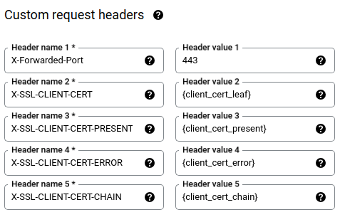

### Enable mutual TLS authentication

https://cloud.google.com/load-balancing/docs/mtls

### Enable custom headers for the backend in GCP 'Application Load Balancer'



where 'X-SSL-CLIENT-CERT-CHAIN' header is optional

### Deploy x509 gcp provider

```cp keycloak-x509-lookup-gcp-x.x.x.jar $KEYCLOAK_HOME/providers/```

### Configure keycloak to use x509 gcp provider

* Enable the corresponding proxy provider

  ```bin/kc.[sh|bat] build --spi-x509cert-lookup-provider=gcp```

* Configure the HTTP headers

  https://www.keycloak.org/server/reverseproxy

  ```bin/kc.[sh|bat] start --spi-x509cert-lookup-gcp-ssl-client-cert=X-SSL-CLIENT-CERT --spi-x509cert-lookup-gcp-ssl-cert-chain-prefix=X-SSL-CLIENT-CERT-CHAIN --spi-x509cert-lookup-gcp-certificate-chain-length=10```


